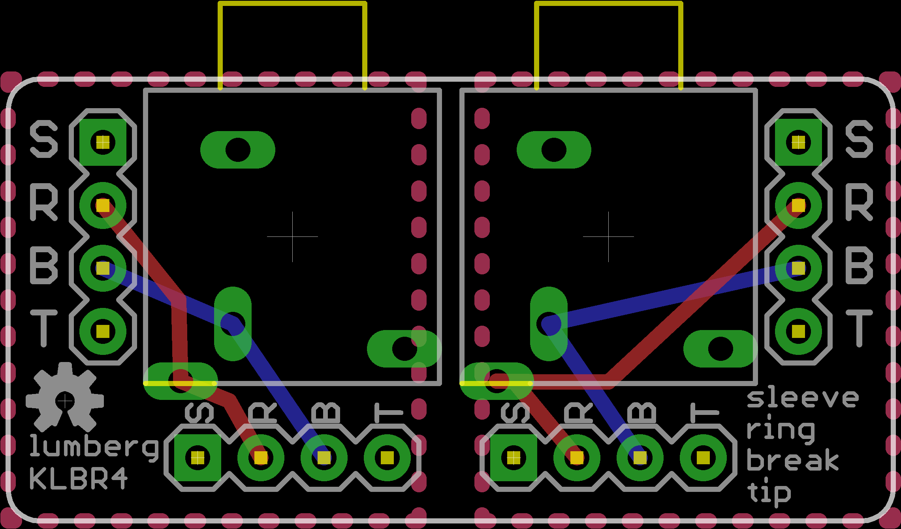
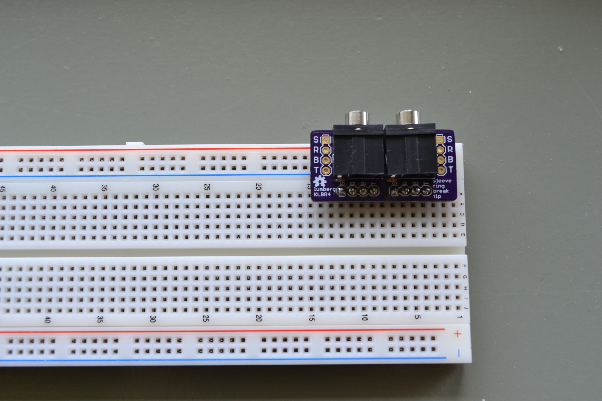
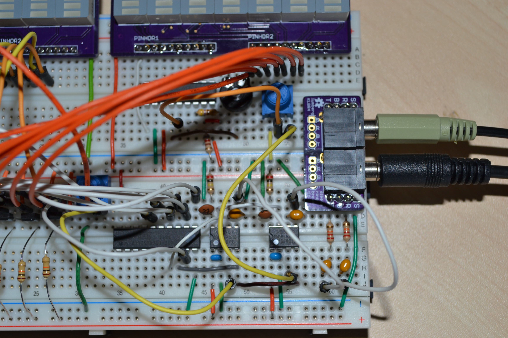

Lumberg KLBR4 breakout board
============================

None of the 3.5mm audio jacks I know of fit on a standard breadboard. Here is a breakout board for the
"Lumberg KLBR4" audio jack to fix this.

## Board layout

  

## Examples

  

  

Where to get
============

## Audio jack

[Reichelt Elektronik (Germany)](http://www.reichelt.de/LUM-KLBR-4/3/index.html?&ACTION=3&LA=446&ARTICLE=116186&artnr=LUM+KLBR+4&SEARCH=klbr4)

## PCB

[OSH Park - klbr4 breakout](https://oshpark.com/shared_projects/lQV1U9tV)

