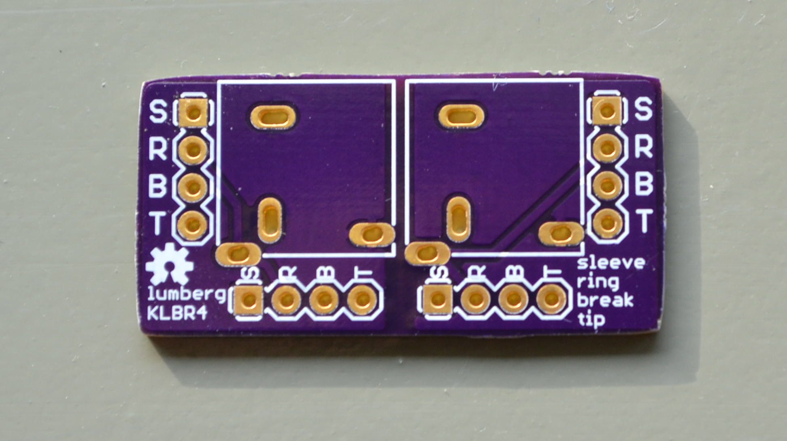
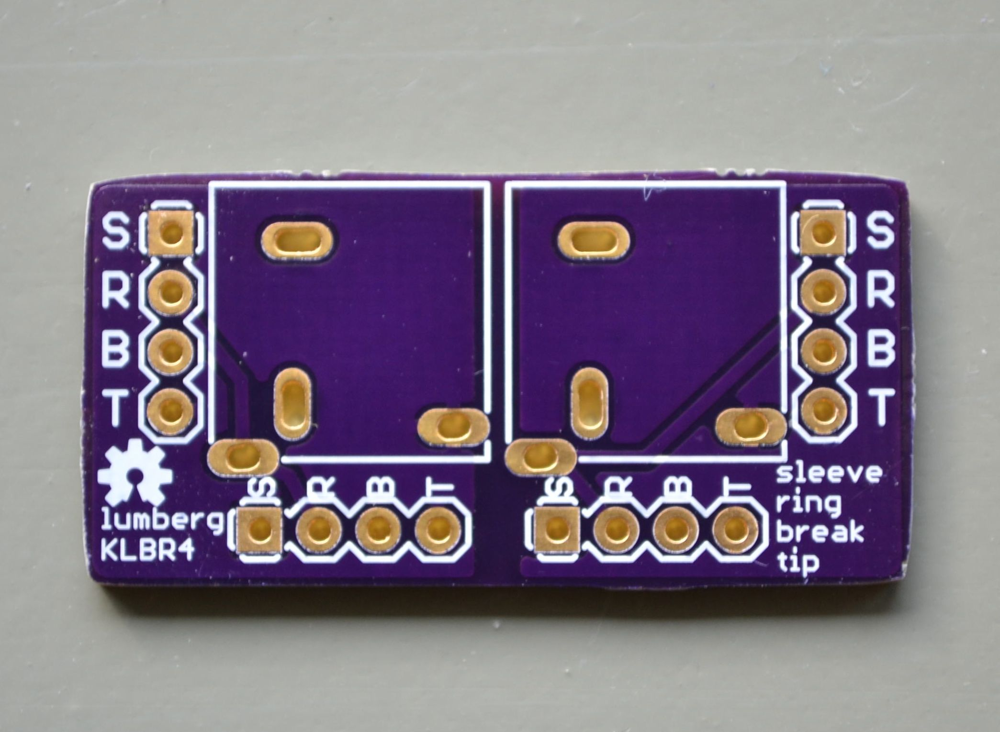

# Lumberg KLBR4 breakout board

None of the 3.5mm audio jacks I know of fit on a standard breadboard. Here is a breakout board for the
"Lumberg KLBR4" audio jack to fix this.

  

  

  

  

  

Distributors
============

[Reichelt Elektronik (Germany)](http://www.reichelt.de/LUM-KLBR-4/3/index.html?&ACTION=3&LA=446&ARTICLE=116186&artnr=LUM+KLBR+4&SEARCH=klbr4)

